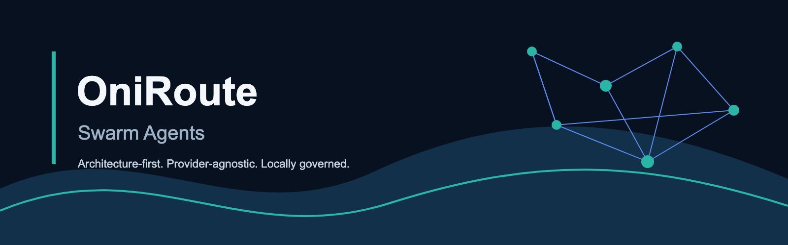
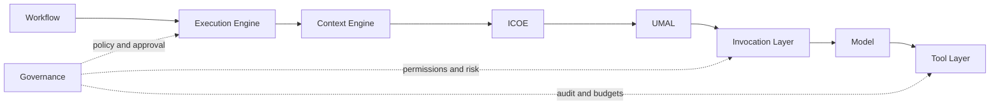
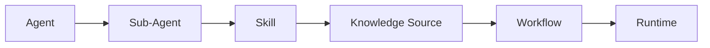
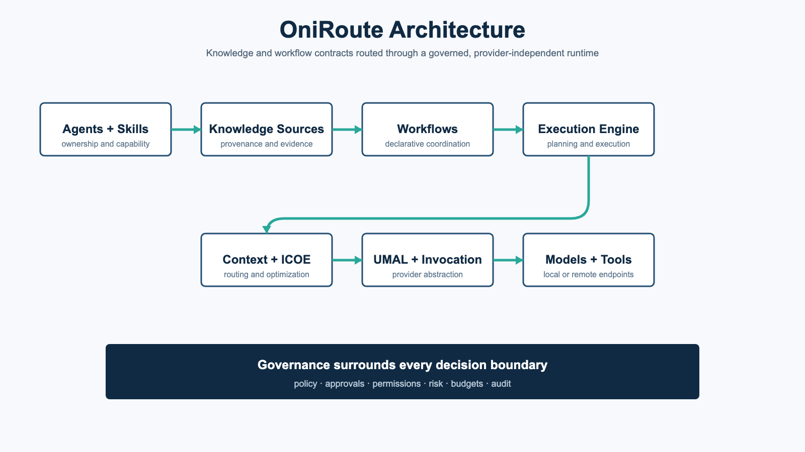
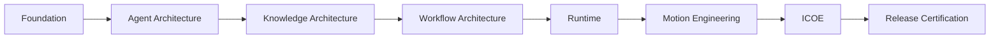

<p align="center">
  
</p>

<h1 align="center">OniRoute Swarm Agents</h1>

<p align="center"><strong>Provider-Agnostic Multi-Agent Framework for Knowledge, Workflows, Runtime, and AI Orchestration.</strong></p>

<p align="center">
  <a href="LICENSE"></a>
  <a href="pyproject.toml"></a>
  <a href="VERSION"></a>
  <a href="docs/RUNTIME_ARCHITECTURE.md"></a>
  <a href="docs/ACR002_FREEZE.md"></a>
  
  <a href="docs/CLI_REFERENCE.md"></a>
  
  
  <a href="docs/COMMUNITY_IMPORT_VERIFICATION.md"></a>
  <a href="docs/OFFICIAL_SKILL_INDEX.md"></a>
</p>

<p align="center">
  <a href="https://github.com/AniruddhaDas1/OniRoute_SwarmAgents/stargazers"></a>
  <a href="https://github.com/AniruddhaDas1/OniRoute_SwarmAgents/forks"></a>
  <a href="https://github.com/AniruddhaDas1/OniRoute_SwarmAgents/issues"></a>
  <a href="https://github.com/AniruddhaDas1/OniRoute_SwarmAgents/commits/main"></a>
  
</p>

OniRoute is an architecture-first framework for modeling and operating a governed engineering organization made of specialized Agents, reusable Skills, declarative Workflows, Knowledge Sources, model abstractions, Tools, and a local Python runtime. It was created to make multi-agent systems understandable before they become executable: ownership, boundaries, provenance, policy, and information flow are explicit repository contracts.

The project is designed for AI platform engineers, software architects, agent-system researchers, developer-tool builders, and teams that need a provider-independent foundation instead of an application tied to one model API. Local execution and inspectable metadata remain first-class, while remote endpoints are opt-in.

> [!IMPORTANT]
> Version 1.0.0 certifies the existing architecture. Runtime v0.6, Motion Engineering, and ICOE v1.1 are frozen. Future architectural changes require an approved Architecture Change Request.

## Navigate

[Why OniRoute](#why-oniroute) · [Features](#features) · [Architecture](#architecture) · [Statistics](#repository-statistics) · [Install](#installation) · [Quick Start](#quick-start) · [CLI](#cli-reference) · [Models](#supported-models-and-endpoints) · [Community Policy](#community-metadata-policy) · [Documentation](#project-documentation) · [Contributing](#contributing) · [License](#license)

## Why OniRoute

| Principle | What it means in OniRoute |
|---|---|
| Provider-independent | Core contracts do not depend on a specific model vendor, cloud, SDK, or hosted service. |
| Model-independent | Selection is capability-driven through the Universal Model Abstraction Layer (UMAL). |
| Workflow-first | Multi-agent collaboration is declared, planned, inspected, and governed before execution. |
| Knowledge-first | Sources carry provenance, trust, validation, lifecycle, and compatibility metadata. |
| Governance-first | Policy, approvals, permissions, risk, budgets, and audit are execution boundaries. |
| Local-first | Discovery, validation, planning, Dry Run, optimization, and metadata operations work locally. |
| Extensible | Providers, models, Tools, and future adapters meet stable interfaces rather than changing ownership layers. |
| Open architecture | Decisions, freezes, limitations, audits, and change controls are documented in the repository. |

Provider independence matters because organizational knowledge and workflows usually outlive individual models. OniRoute keeps durable operating contracts separate from replaceable inference infrastructure.

## Features

| Capability | Role |
|---|---|
| Agent Architecture | Defines accountable top-level Agents and bounded Sub-Agent responsibilities. |
| Knowledge Engine | Registers sources, provenance, trust, validation, and resolution relationships. |
| Workflow Engine | Plans and runs declarative multi-agent collaboration locally. |
| Runtime v0.6 | Loads, validates, resolves, plans, executes, records events, and produces artifacts. |
| Context Engine | Builds immutable, scoped context across Agent, Skill, and Workflow boundaries. |
| ICOE v1.1 | Optimizes context, prompts, repositories, artifacts, terminals, and conversations deterministically. |
| UMAL | Selects models by capability, protocol, provider, health, and local preference. |
| Tool Layer | Models local Tools and MCP servers with capability, permission, trust, and health metadata. |
| Governance | Enforces approvals, permissions, risk controls, budgets, policy, and audit records. |
| Motion Engineering | Provides frozen motion-system architecture and original Official Motion Skills. |
| CLI | Exposes 45 commands for discovery, planning, execution, governance, models, Tools, and optimization. |
| Community Metadata | Preserves independently authored source metadata without redistributing upstream content. |

## Architecture

The runtime routes declarative work through explicit transformation and governance boundaries. ICOE optimizes information before UMAL chooses an eligible model path; invocation adapters translate only at the endpoint boundary.



The repository architecture connects organizational ownership to reusable capability, evidence, coordination, and execution:



Read the [Architecture Overview](docs/ARCHITECTURE_OVERVIEW.md), [Runtime Architecture](docs/RUNTIME_ARCHITECTURE.md), and [Architecture History](docs/ARCHITECTURE_HISTORY.md) for the detailed contracts and evolution.

### Architecture Image

<p align="center">
  
</p>

Explore the [Interactive Architecture](https://chatgpt.com/s/m_6a71ed787a188191b3cc2413f072cdc8).

## Repository Statistics

| Measure | Count | Measure | Count |
|---|---:|---|---:|
| Top-Level Agents | 31 | Sub-Agents | 265 |
| Official Skills | 96 | Community Metadata Entries | 991 |
| Knowledge Sources | 16 | Official Workflows | 20 |
| Runtime Modules | 87 | Optimization Modules | 13 |
| CLI Commands | 45 | Tests | 34 |
| Release | 1.0.0 | License | Apache-2.0 |

## Repository Structure

```text
OniRoute_SwarmAgents/
├── agents/          Organizational Agents and bounded Sub-Agents
├── skills/          Official Skills, Community metadata, and Skill governance
├── workflows/       Workflow specification, resolution, registry, and Official library
├── knowledge/       Knowledge Source schemas, registry records, and governance
├── runtime/         Frozen v0.6 Python runtime and ICOE implementation
├── cli/             Typer command-line interface
├── config/          Runtime, model, Tool, optimization, and governance configuration
├── mappings/        Agent, Skill, Workflow, Motion, and package relationships
├── packages/        Package specification and frozen package metadata
├── schemas/         Repository validation schemas
├── examples/        Runnable and inspectable usage examples
├── templates/       Contribution-ready metadata templates
├── tests/           Runtime, invocation, governance, Tool, and optimization tests
├── docs/            Architecture, operations, audits, policy, and release documentation
└── .github/         CI, issue forms, pull-request template, support, and conduct guidance
```

## Installation

OniRoute requires Python 3.12 or newer and Git.

```bash
git clone https://github.com/AniruddhaDas1/OniRoute_SwarmAgents.git
cd OniRoute_SwarmAgents

python -m venv .venv
source .venv/bin/activate        # Windows: .venv\Scripts\activate

python -m pip install --upgrade pip
python -m pip install -e .

oniroute --help
oniroute doctor
```

For contributor and release tooling:

```bash
python -m pip install -e '.[dev]'
python -m pytest -q
```

See the full [Installation Guide](docs/INSTALLATION.md).

## Quick Start

Validate the repository and explore its contracts:

```bash
oniroute doctor
oniroute inspect agent architecture
oniroute inspect workflow rest-api-design
oniroute search architecture
```

Plan, execute, and explain a Workflow:

```bash
oniroute plan workflow rest-api-design
oniroute run workflow rest-api-design
oniroute explain workflow rest-api-design
oniroute trace
```

Inspect model selection and optimization:

```bash
oniroute recommend-model --capability reasoning --local
oniroute optimize prompt "Design a provider-independent authentication service"
oniroute optimize context '{"goal":"design an API","constraints":["local-first"]}'
```

Invoke a configured endpoint through UMAL:

```bash
oniroute invoke --prompt "Summarize the selected architecture" --model local-default
```

> [!NOTE]
> The default AI approval mode is Dry Run. Real invocation requires an explicitly configured compatible endpoint and applicable governance approval.

Continue with the [Quick Start Guide](docs/QUICKSTART.md) and [CLI Reference](docs/CLI_REFERENCE.md).

## CLI Reference

| Command group | Purpose |
|---|---|
| `doctor` | Load and validate the repository. |
| `list`, `inspect`, `search`, `context` | Discover records and build context views. |
| `plan`, `run`, `explain`, `trace`, `history`, `events` | Plan, execute, and inspect Workflows. |
| `models`, `providers`, `capabilities`, `recommend-model` | Inspect model metadata and capability-driven selection. |
| `tools`, `mcp`, `recommend-tool` | Inspect Tool/MCP metadata and selection. |
| `invoke` | Route a prompt through UMAL and a configured adapter. |
| `policy`, `audit`, `permissions`, `approvals`, `budget` | Inspect governance decisions and local controls. |
| `optimize` | Run deterministic ICOE optimization and reporting commands. |

Run `oniroute COMMAND --help` for exact arguments and exit behavior.

## Supported Models and Endpoints

OniRoute implements reference invocation adapters for **OpenAI-compatible HTTP endpoints** and **Ollama**. That covers local or remote deployments exposing compatible protocols, including LM Studio, vLLM, llama.cpp servers, LocalAI, Groq, Together, Fireworks, and compatible DeepSeek deployments when configured appropriately.

The metadata architecture also describes Anthropic-compatible and Gemini-compatible protocols without claiming that their native SDK translations are implemented in runtime v0.6. Model-family metadata can represent Llama, Qwen, Gemma, Phi, Mistral, DeepSeek, and other compatible local or remote models.

| Level | Current support |
|---|---|
| Implemented adapters | OpenAI-compatible, Ollama |
| Compatible deployments | LM Studio, vLLM, llama.cpp, LocalAI, compatible hosted endpoints |
| Provider metadata | OpenAI, Anthropic, Google, Groq, Together, Fireworks, DeepSeek, Mistral, and others |
| Model families | Llama, Qwen, Gemma, Phi, Mistral, DeepSeek, custom models |

## Provider Independence

OniRoute does not place provider-specific SDK objects inside Agents, Skills, Workflows, Context, governance, or execution plans. Provider and protocol details are resolved at the model and invocation boundary. This keeps organizational design portable, makes local models first-class, and allows endpoints to change without rewriting durable architecture.

Provider independence does not mean every provider has a native adapter today. It means the reusable contracts remain neutral and new translations must meet the frozen interface and governance boundaries.

## Community Metadata Policy

Community repositories are represented through independently authored metadata, provenance, reference links, license declarations, validation decisions, and compatibility classifications.

OniRoute does **not** redistribute Community:

- source code;
- prompts or Skill bodies;
- README or documentation bodies;
- examples or tests;
- workflows, scripts, or assets;
- repository structures.

Official OniRoute architecture, Skills, Workflows, runtime, Motion Engineering, ICOE, documentation, and governance are independently authored OniRoute work. Review the [Community Import Verification](docs/COMMUNITY_IMPORT_VERIFICATION.md), [Metadata Verification](docs/METADATA_VERIFICATION.md), and [License Decision Record](docs/LICENSE_DECISION_RECORD.md).

## Development Journey



The project progressed through explicit phases, freezes, audits, and two approved Architecture Change Requests. This history is preserved so future contributors can distinguish original intent, implemented scope, accepted limitations, and extension boundaries.

## Roadmap

Version 1.0.0 is architecture-complete. Future development occurs only through approved Architecture Change Requests (ACRs) or explicitly authorized release phases. Proposals must identify the affected layer, ownership boundary, compatibility impact, validation plan, and migration requirements.

See [Versioning](docs/VERSIONING.md), [Release Process](docs/RELEASE_PROCESS.md), and [Architecture History](docs/ARCHITECTURE_HISTORY.md).

## Project Documentation

| Area | Documentation |
|---|---|
| Start here | [Installation](docs/INSTALLATION.md) · [Quick Start](docs/QUICKSTART.md) · [FAQ](docs/FAQ.md) · [Troubleshooting](docs/TROUBLESHOOTING.md) |
| Interfaces | [CLI Reference](docs/CLI_REFERENCE.md) · [Developer Guide](docs/DEVELOPER_GUIDE.md) |
| Architecture | [Overview](docs/ARCHITECTURE_OVERVIEW.md) · [History](docs/ARCHITECTURE_HISTORY.md) · [Runtime](docs/RUNTIME_ARCHITECTURE.md) |
| Knowledge and Workflows | [Knowledge Resolution](docs/KNOWLEDGE_RESOLUTION_ARCHITECTURE.md) · [Workflow Architecture](docs/WORKFLOW_ARCHITECTURE.md) |
| Extensions | [Motion Freeze](docs/MOTION_FREEZE.md) · [Optimization Guide](docs/OPTIMIZATION_GUIDE.md) · [ICOE Freeze](docs/ACR002_FREEZE.md) |
| Community | [Contributing](docs/CONTRIBUTING.md) · [Security](docs/SECURITY.md) · [Support](.github/SUPPORT.md) · [Code of Conduct](.github/CODE_OF_CONDUCT.md) |
| Compliance | [Open Source Compliance](docs/OPEN_SOURCE_COMPLIANCE.md) · [Third-Party Notices](docs/THIRD_PARTY_NOTICES.md) · [Release Certificate](docs/V1_RELEASE_CERTIFICATE.md) |

## Developer

### Aniruddha Das

Original developer and architecture author of OniRoute.

| Profile | Link |
|---|---|
| GitHub | [github.com/AniruddhaDas1](https://github.com/AniruddhaDas1) |
| LinkedIn | [linkedin.com/in/aniruddha1](https://www.linkedin.com/in/aniruddha1/) |
| X | [x.com/ani294](https://x.com/ani294) |
| Instagram | [instagram.com/aniruddha.dev_official](https://instagram.com/aniruddha.dev_official) |

## Powered By

OniRoute is powered by [LeadSpree Business Solutions](https://leadspree.in).

## Research Acknowledgements

These repositories informed metadata research or high-level concept review. No entry below implies copied implementation.

| Repository | Purpose | License | Usage |
|---|---|---|---|
| [alirezarezvani/claude-skills](https://github.com/alirezarezvani/claude-skills) | Community capability discovery | MIT | Metadata Only |
| [open-gsd/gsd-core](https://github.com/open-gsd/gsd-core) | Planning and workflow capability discovery | MIT | Metadata Only |
| [garrytan/gstack](https://github.com/garrytan/gstack) | Engineering capability discovery | MIT | Metadata Only |
| [pbakaus/impeccable](https://github.com/pbakaus/impeccable) | Interface and presentation capability discovery | Apache-2.0 | Metadata Only |
| [mattpocock/skills](https://github.com/mattpocock/skills) | Engineering practice capability discovery | MIT | Metadata Only |
| [leonxlnx/taste-skill](https://github.com/leonxlnx/taste-skill) | Design-quality capability discovery | MIT | Metadata Only |
| [vuejs-ai/skills](https://github.com/vuejs-ai/skills) | Vue capability discovery | MIT | Metadata Only |
| [knoxgraeme/skillfish](https://github.com/knoxgraeme/skillfish) | Registry and lifecycle concepts | AGPL-3.0 | Reference Only |
| [multica-ai/andrej-karpathy-skills](https://github.com/multica-ai/andrej-karpathy-skills) | AI engineering source review | Unknown | Reference Only; excluded from admission |
| [motiondivision/motion](https://github.com/motiondivision/motion) | Declarative motion and gesture concepts | MIT | Research Only |
| [pmndrs/react-spring](https://github.com/pmndrs/react-spring) | Spring dynamics and interpolation concepts | MIT | Research Only |
| [Popmotion/popmotion](https://github.com/Popmotion/popmotion) | Historical motion-model concepts | Unknown | Reference Only |
| [animate-css/animate.css](https://github.com/animate-css/animate.css) | Transition vocabulary review | Hippocratic License 2.1 | Research Only; excluded from reuse |
| [radix-ui/primitives](https://github.com/radix-ui/primitives) | Accessible interaction-state concepts | MIT | Research Only |
| [shadcn-ui/ui](https://github.com/shadcn-ui/ui) | Composable interaction-pattern concepts | MIT | Research Only |
| [emilkowalski/sonner](https://github.com/emilkowalski/sonner) | Feedback and notification sequencing concepts | MIT | Research Only |

Detailed decisions and attribution are maintained in the [License Compliance Matrix](docs/LICENSE_COMPLIANCE_MATRIX.md) and [Third-Party Notices](docs/THIRD_PARTY_NOTICES.md).

## Contributing

Contributions are welcome within the frozen architecture and governance boundaries. Start with the [Contribution Guide](docs/CONTRIBUTING.md), [Developer Guide](docs/DEVELOPER_GUIDE.md), [Code of Conduct](.github/CODE_OF_CONDUCT.md), and pull-request template.

## GitHub Repository Presentation

| Setting | Suggested value |
|---|---|
| Description | Provider-agnostic multi-agent framework for knowledge, workflows, runtime, governance, and AI orchestration. |
| Tagline | Architecture-first swarm agents, governed locally. |
| Website | `https://leadspree.in` |
| Topics | `ai-agents`, `multi-agent-systems`, `agentic-ai`, `workflow-engine`, `knowledge-graph`, `local-first`, `provider-agnostic`, `model-agnostic`, `python`, `llm`, `governance`, `developer-tools` |
| Social preview | `docs/images/oniroute-banner.png` |

These values are recommendations only; this repository does not modify GitHub settings automatically.

## License

OniRoute is licensed under the [Apache License 2.0](LICENSE). Attribution and authorship are recorded in [NOTICE](NOTICE) and [AUTHORS](AUTHORS).

Community repository records retain their own provenance and license information. They remain metadata or references and are not relicensed as OniRoute implementation.

---

<p align="center">
  Built with ❤️ by <a href="https://github.com/AniruddhaDas1">Aniruddha Das</a><br>
  Powered by <a href="https://leadspree.in">LeadSpree Business Solutions</a><br>
  Apache License 2.0
</p>
