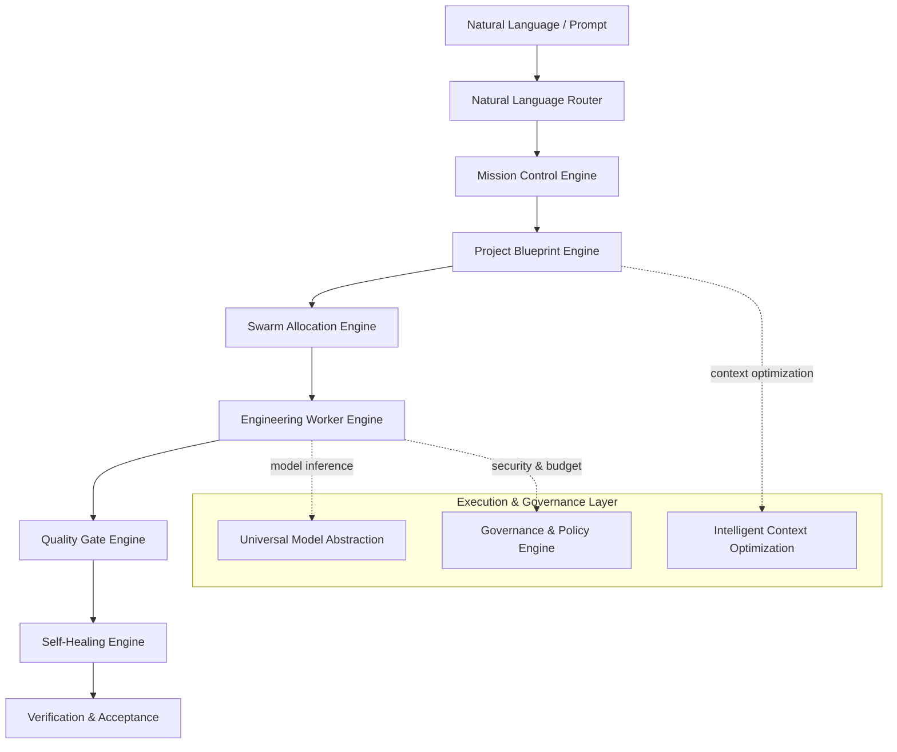
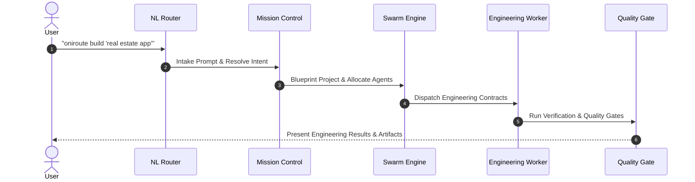

<p align="center">
  
</p>

<h1 align="center">OniRoute Swarm Agents</h1>

<p align="center"><strong>Organization Level Swarm Coding AI Agents — Local-First, Provider-Independent Swarm AI Architecture & Runtime.</strong></p>

<p align="center">
  <a href="LICENSE"></a>
  <a href="pyproject.toml"></a>
  <a href="VERSION"></a>
  <a href="docs/ONIROUTE_CERTIFICATION_REPORT.md"></a>
  <a href="docs/RUNTIME_ARCHITECTURE.md"></a>
  <a href="docs/INSTALL.md"></a>
  
  <a href="docs/CLI_REFERENCE.md"></a>
  
  
</p>

<p align="center">
  <a href="https://github.com/AniruddhaDas1/OniRoute_SwarmAgents/stargazers"></a>
  <a href="https://github.com/AniruddhaDas1/OniRoute_SwarmAgents/forks"></a>
  <a href="https://github.com/AniruddhaDas1/OniRoute_SwarmAgents/issues"></a>
  <a href="https://github.com/AniruddhaDas1/OniRoute_SwarmAgents/commits/main"></a>
</p>

---

## Project Overview

OniRoute is an architecture-first, local-first framework for modeling, operating, and orchestrating governed engineering organizations composed of specialized AI Agents, reusable Skills, declarative Workflows, Knowledge Sources, Universal Model Abstractions (UMAL), and local runtime engines.

Version **1.2.0 ("Swarm Intelligence")** certifies the complete Product Layer (P1–P6), adding zero-setup multi-platform distribution (`pipx`, `pip`, Homebrew, Docker, Standalone Executables), interactive natural language routing, hierarchical configuration, and automated release engineering.

---

## Architecture Diagram

The runtime routes declarative work through explicit transformation, optimization, and governance boundaries:



---

## Supported Platforms

| Platform | Support | Distribution Vehicle |
| :--- | :--- | :--- |
| **macOS** (12+, `arm64`, `x86_64`) | Fully Supported | Homebrew, `pipx`, `pip`, Standalone Executable |
| **Linux** (Ubuntu 22.04+, Debian 12+, Fedora, Arch) | Fully Supported | Docker, `pipx`, `pip`, Standalone Executable |
| **Windows** (10/11 `x86_64`, WSL2) | Fully Supported | `pipx`, `pip`, Standalone `.exe` Executable |
| **Python Runtimes** | Python >= 3.12 (3.12, 3.13, 3.14) | PyPI Wheel & Source Distribution |

---

## Installation

Choose your preferred installation method:

### 1. pipx (Recommended for CLI)
```bash
pipx install oniroute-swarmagents
```

### 2. Standard pip
```bash
pip install oniroute-swarmagents
```

### 3. Homebrew (macOS / Linux)
```bash
brew install oniroute/tap/oniroute
```

### 4. Docker Container
```bash
docker run --rm -v $(pwd):/workspace oniroute/oniroute:1.2.0 build "my app"
```

### 5. Automated Install Script
```bash
curl -fsSL https://raw.githubusercontent.com/AniruddhaDas1/OniRoute_SwarmAgents/main/scripts/install.sh | bash
```

See [docs/INSTALL.md](docs/INSTALL.md) for full installation details.

---

## Quick Start

Get started with OniRoute in 3 simple commands:

```bash
# 1. Initialize your workspace (detects platform, Git, Docker, and MCP)
oniroute init

# 2. Run system diagnostics
oniroute doctor

# 3. Build a project using Natural Language
oniroute build "Create a modern real estate web application with Next.js and Tailwind"
```

See [docs/QUICKSTART.md](docs/QUICKSTART.md) for a detailed walkthrough.

---

## Mission Flow



---

## Examples

### 1. Natural Language Project Creation
```bash
oniroute build "A high-performance REST API in FastAPI with PostgreSQL and JWT auth"
```

### 2. Workspace Diagnostics & Storage Inspection
```bash
oniroute workspace
```

### 3. Configuration Management
```bash
# View configuration
oniroute config

# Set log level
oniroute config logging_level --set DEBUG

# Validate configuration
oniroute config --validate
```

---

## CLI Commands Summary

OniRoute features 59 registered CLI commands in `cli/main.py`:

| Category | Primary Commands |
| :--- | :--- |
| **Distribution** | `init`, `doctor`, `config`, `update`, `version` |
| **Natural Language** | `build`, `create`, `fix`, `refactor`, `migrate` |
| **Discovery** | `workspace`, `list`, `inspect`, `search`, `skills`, `rank-skills` |
| **Orchestration** | `execute`, `run`, `plan`, `coordinate`, `mission`, `deployment` |
| **Engineering** | `scaffold`, `blueprint-project`, `allocate`, `contracts`, `engineer`, `heal` |
| **Governance** | `policy`, `audit`, `approvals`, `permissions`, `budget` |

See [docs/CLI_REFERENCE.md](docs/CLI_REFERENCE.md) for complete CLI documentation.

---

## Configuration

OniRoute uses a 3-tier configuration hierarchy (Environment Overrides > Project Config > Global Config):

- **Global Config**: `~/.config/oniroute/config.yaml`
- **Project Config**: `.oniroute/config.yaml`
- **Environment Overrides**:
  - `ONIROUTE_LOG_LEVEL`: `DEBUG | INFO | WARNING | ERROR`
  - `ONIROUTE_MAX_CONCURRENT`: Max concurrent missions (e.g. `3`)
  - `ONIROUTE_QUALITY_THRESHOLD`: Quality threshold (0–10, default `8.0`)
  - `ONIROUTE_TELEMETRY`: `true | false`

See [docs/CONFIGURATION.md](docs/CONFIGURATION.md) for full configuration specifications.

---

## Repository Statistics

- **Python Core & Runtime**: 309 files (43,672 LOC)
- **Documentation Suite**: 6,689 Markdown files (90,293 Lines)
- **Declarative YAML Contracts**: 1,436 schema files
- **Automated Tests**: 671 test cases (100% pass rate)

---

## Roadmap

- [x] **v1.0.0 — Core Engine Frozen**: Runtime v0.6, ICOE v1.1, UMAL, Governance.
- [x] **v1.2.0 — Product Layer Frozen**: Zero-setup distribution (`pipx`, `brew`, `docker`), `init`, `config`, `doctor`, `update`, `version`, NL Router.
- [ ] **v1.3.0 — Distributed Swarm Mesh**: Multi-node remote agent coordination over gRPC/WebSocket.

---

## Contributing

We welcome community contributions! Please read [CONTRIBUTING.md](docs/CONTRIBUTING.md) and [AGENTS.md](AGENTS.md) before submitting pull requests.

---

## License

OniRoute is released under the **Apache-2.0 License**. See [LICENSE](LICENSE) for details.
