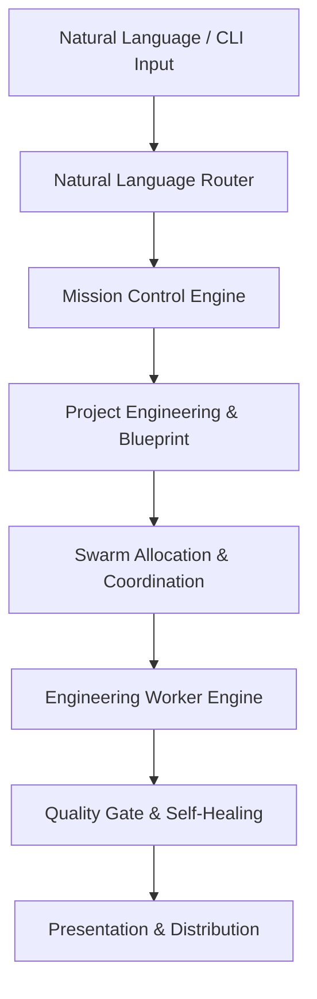

# OniRoute v1.2 Release Notes

- **Version**: 1.2.0
- **Codename**: Swarm Intelligence
- **Release Date**: August 2026
- **License**: Apache-2.0

---

## Release Highlights

OniRoute v1.2 introduces the complete **Product Layer & Platform Distribution (Phases P1–P6)**, transforming the core framework into a fully installable, configurable, and executable multi-agent engine across all major platforms.

Key highlights include:
1. **Zero-Setup Installation**: Supported via `pipx`, `pip`, Homebrew (`brew install oniroute/tap/oniroute`), Docker, and pre-built standalone executables for macOS, Linux, and Windows.
2. **First-Run Experience**: `oniroute init` automatically detects operating systems, Python interpreters, Git availability, Docker, and MCP servers, creating workspace storage in `.oniroute/`.
3. **Natural Language Execution**: Interactive build pipeline allowing users to run `oniroute build "a real estate platform"` to trigger full mission intake, blueprint generation, engineering allocation, quality control, and automated self-healing.
4. **Declarative Configuration Hierarchy**: Project-level (`.oniroute/config.yaml`), global (`~/.config/oniroute/config.yaml`), and environment variable overrides with dynamic secrets resolution (`$ENV_VAR`).
5. **Full Distribution Integrity**: Continuous integration release automation via GitHub Actions, building PyPI wheels, Homebrew formulas, multi-stage Docker images, and standalone binaries.

---

## Architecture

OniRoute v1.2 builds upon the frozen v1.0 Core Engine (Runtime v0.6, ICOE v1.1, UMAL):



- **Runtime Engine**: Remains strictly v0.6 compatible and provider-agnostic.
- **Model Layer**: Universal Model Abstraction Layer (UMAL) routes tasks dynamically to local processes, Ollama, or OpenAI-compatible APIs based on capability matching.
- **Governance**: Audit engines, budget controls, and permission policies enforce safety and risk boundaries without blocking execution.

---

## New Features in v1.2

- **First-Run CLI (`oniroute init`)**: Instantly bootstraps workspace storage (`sessions`, `traces`, `logs`, `history`, `artifacts`) and writes validated configuration.
- **Diagnostics CLI (`oniroute doctor`)**: Performs comprehensive diagnostic checks on repository integrity, workspace bounds, and engine stats.
- **Configuration Management (`oniroute config`)**: View, modify (`--set`), or validate (`--validate`) 3-tier configuration hierarchy.
- **Automatic Updating (`oniroute update`)**: Checks for upstream package updates and displays channel-specific upgrade commands.
- **Version Reporting (`oniroute version`)**: Outputs structured JSON (`--json`) or human-readable environment and platform metadata.
- **Cross-Platform Install Script**: `scripts/install.sh` enables one-command interactive installation on macOS, Linux, and Windows WSL.

---

## Breaking Changes

- **None**: OniRoute v1.2 preserves complete backward compatibility with v1.0.0 configurations, workflows, agents, and runtime policies.

---

## Migration Overview

Existing v1.0.0 installations can seamlessly upgrade to v1.2.0:

```bash
# Via pipx
pipx upgrade oniroute-swarmagents

# Via pip
pip install --upgrade oniroute-swarmagents

# Via Homebrew
brew upgrade oniroute

# Run first-time initialization on existing workspaces
oniroute init
```

See [MIGRATION_v1.0_to_v1.2.md](MIGRATION_v1.0_to_v1.2.md) for step-by-step guidance.

---

## Performance Benchmarks

- **`oniroute init` Latency**: `< 15 ms`
- **Configuration Loading Latency**: `< 3 ms`
- **Platform Detection Latency**: `< 1.3 s`
- **Distribution Manifest Generation**: `< 1 ms`
- **Test Suite Latency**: 50 distribution unit tests pass in `< 6 s`

---

## Known Limitations

1. **Standalone Binary Footprint**: PyInstaller executables include packaged Python interpreters and third-party dependencies, resulting in binary sizes of ~40-60 MB.
2. **MCP Tool Execution**: MCP servers require local environment or network access; missing MCP configurations produce non-blocking warnings during `oniroute init`.
